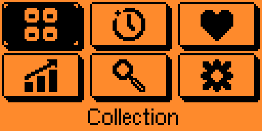
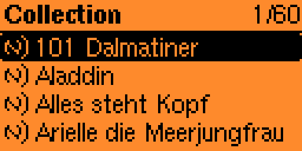
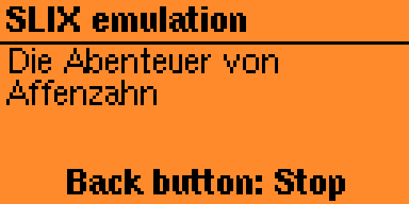
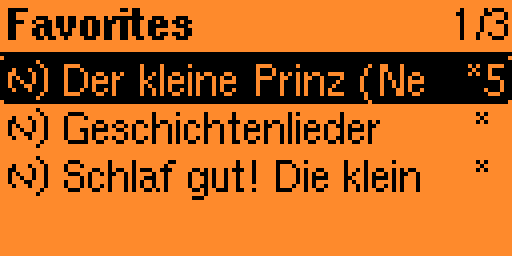
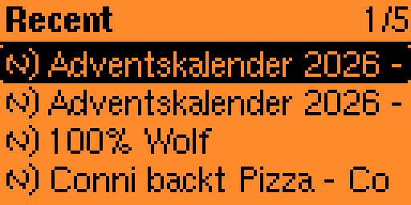
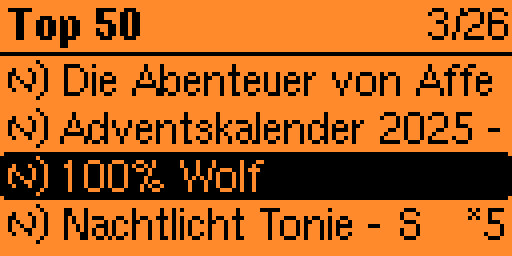
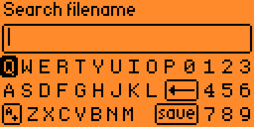
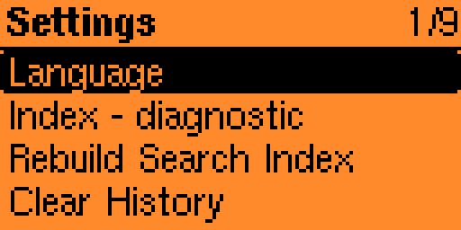

# StoryFlip 0.4.2

**StoryFlip** is a native Flipper Zero application for browsing, searching, organizing and directly emulating a collection of **SLIX `.nfc` files**.

The project started as a personal tool for my own Flipper Zero. It was never planned as a public project, but it became useful enough that I decided to clean it up and publish it.


> **Firmware note**
>
> StoryFlip has only been used and tested with **Momentum Firmware**.
>
> * Momentum mainline `mntm-012` from **2026-01-01**
> * Momentum dev `d3f89dfe` from **2026-08-18**
>
> The included 0.4.2 FAP is built against Momentum dev commit
> `d3f89dfe2ef6b01839201598e9be1590cba80322`,
> SDK API **87.1**, hardware target **7**.

## Highlights

* Browse folders containing SLIX `.nfc` files
* Start SLIX emulation directly from the file list
* Favorites
* 1 to 5 star ratings
* Recent history
* Most-played Top 50
* Persistent filename search index
* Configurable collection root folder
* English, German and French UI
* Persistent settings and metadata
* Context menu available from every NFC-file list
* Static emulation screen with no scrolling animation
* Confirmation dialogs for destructive actions
* Metadata cleanup and index diagnostics

## Installation

Download the latest release from the [Releases page](https://github.com/lowsc0re/StoryFlip/releases).

Copy:

```text
storyflip.fap
```

to:

```text
/ext/apps/NFC/storyflip.fap
```

Then start **StoryFlip** from the NFC applications menu.

For a new installation the default collection root is:

```text
/ext/nfc/StoryFlip/
```

You can change it at any time under:

```text
Settings > Change Root Folder
```

Existing installations keep their saved root path during updates.

StoryFlip stores its own settings and metadata separately in:

```text
/ext/apps_data/storyflip/
```

When updating the app, replace the FAP but keep this directory if you want to preserve your settings, favorites, ratings, history and search data.

## Main menu

The home screen contains six fixed entries:

| Left | Center | Right |
| --- | --- | --- |
| Collection | Recent | Favorites |
| Statistics | Search | Settings |

The UI language can be changed between **English**, **Deutsch** and **Français**. English is used on the first start.



## Collection and controls

Open **Collection** to browse the configured root folder and its subfolders.



| Input                         | Action                                     |
| ----------------------------- | ------------------------------------------ |
| Up / Down                     | Move through the current list              |
| OK on a folder                | Open the folder                            |
| OK on an NFC file             | Start SLIX emulation                       |
| Back                          | Go to the parent folder or previous screen |
| **Hold Right on an NFC file** | Open the StoryFlip context menu            |

Normal browsing reads only the currently opened directory. Up to three opened folders can be cached under a combined 24 KiB name-data budget.

## Context menu

Hold **Right** on any NFC file to open the StoryFlip context menu.

This works from:

* Collection
* Recent
* Favorites
* Search results
* Rating result lists
* Most played


The context menu contains:

* **Information**  
  Shows the filename, favorite state, rating, recorded starts and last-start information.

* **Add favorite / Remove favorite**  
  Toggles the favorite flag.

* **Set rating**  
  Assigns a rating from 1 to 5 stars.

* **Remove rating**  
  Clears the saved rating.

* **Delete NFC file**  
  Deletes the selected original `.nfc` file after an explicit confirmation.

Favorites, ratings and statistics are StoryFlip metadata. Changing them does not modify the original NFC file.

## Emulation

Press **OK** on an NFC file to start emulation.

StoryFlip 0.4.2 only starts files whose protocol is recognized as **SLIX**. A missing file, load failure, unsupported protocol, NFC initialization problem or insufficient memory does not increment the start counter.

A start is counted after the file has loaded, the protocol check has passed and the SLIX listener has been started. This is **not** proof that an external reader accepted or played the emulated tag.

While emulation is active:

* the screen stays static
* long text is clipped instead of animated
* other buttons are ignored
* **Back** stops emulation and returns to the list

The source NFC file is never written back during emulation.



## Favorites and ratings

Favorite files appear in the dedicated **Favorites** view.



Ratings are stored from **1 to 5 stars** and can be browsed through **Statistics > Ratings**.

A `*` at the right side of a list entry marks a favorite. A number next to it shows the saved star rating.

The Statistics menu provides access to ratings and the most-played list.


## Recent and most played

**Recent** shows the five most recently started distinct filenames.

StoryFlip uses an internal monotonically increasing start order so that multiple starts within the same second remain correctly ordered.



**Statistics > Most played** shows up to 50 entries ordered by recorded start count.



Clearing history resets recent ordering while keeping the total start counters.

## Search

StoryFlip uses its own persistent filename index.

On the first search, the app asks to build a complete index for the configured collection root.

The indexer:

* walks the configured root and its subfolders
* records directories and NFC-file paths
* does not read NFC payload contents while indexing
* stores its working queue on the SD card
* keeps the previous valid index if a rebuild is cancelled

Search performs a substring match against filenames and ignores ASCII letter case.

New or moved files become searchable after **Rebuild Search Index**.



## Changing the root folder

Open:

```text
Settings > Change Root Folder
```

The picker starts at `/ext`.

Navigate into the desired directory and select:

```text
> Use this Folder
```

This action is deliberately shown in bold and is the only ordinary list action prefixed by `>`.

After changing the root, StoryFlip offers to rebuild the search index because paths from the previous root may no longer be valid.

A successful rebuild can update stored paths for existing metadata when the exact filename is found again.

## Settings

StoryFlip 0.4.2 uses the same settings order in all three languages:

1. Language
2. Index - diagnostic
3. Rebuild Search Index
4. Clear History
5. Clear Ratings
6. Clear Favorites
7. Clean Metadata
8. Change Root Folder
9. About StoryFlip



### Index - diagnostic

Shows diagnostic information about the metadata store, search index, available memory and current root.

### Clean Metadata

Removes metadata records whose stored file path no longer exists.

It does **not** recursively search the collection for another copy of a moved file.

### About StoryFlip

The About screen contains the app name, version and a short development note.

## Storage model

StoryFlip keeps application data under:

```text
/ext/apps_data/storyflip/
```

Persistent files:

```text
config.a / config.b   Root folder and language
meta.a   / meta.b     Favorites, ratings, starts and history
search.a / search.b   Search index and associated root
list.tmp / queue.tmp  Temporary working files
```

Configuration, metadata and search data use two alternating slots with generation counters and CRC32 validation. The app writes the inactive slot, synchronizes it and validates it before that generation becomes active.

The exact full filename including `.nfc` is StoryFlip's logical metadata identity. Two files with exactly the same filename in different folders therefore share StoryFlip metadata.

## AI-assisted development

StoryFlip is a personal project built with **AI-assisted coding**. I am not a software developer.

The StoryFlip splash-screen artwork was based on an AI-generated reference and manually redrawn pixel by pixel. The six main-menu icons were drawn pixel by pixel by hand.

The small folder and NFC list icons are based on Momentum Firmware assets and are documented in `ASSET-NOTICES.md`.

## Firmware compatibility

| Firmware | Date | Status |
| --- | --- | --- |
| Momentum mainline `mntm-012` | 2026-01-01 | Used/tested with StoryFlip |
| Momentum dev `d3f89dfe` | 2026-08-18 | Used/tested; build SDK for 0.4.2 |
| Official Flipper Zero firmware | - | Not tested |
| Other custom firmware | - | Not tested |

The 0.4.2 binary is built against:

```text
d3f89dfe2ef6b01839201598e9be1590cba80322
```

See [VALIDATION.md](VALIDATION.md) for build information, host-test coverage and on-device validation.

## Building from source

Requirements:

* Python 3
* `ufbt`
* Internet access for the pinned Momentum SDK and ARM toolchain

From the project directory:

```bash
python3 build.py
```

On Windows:

```powershell
python build.py
```

The build helper uses a local `.build-sdk` directory, downloads the pinned SDK and verifies its SHA256.

Alternatively, place the project in a matching Momentum Firmware checkout under:

```text
applications_user/storyflip/
```

and build with:

```bash
./fbt fap_storyflip
```

## Project layout

```text
StoryFlip/
├── assets/             Splash screens and UI icons
├── docs/
│   └── images/         README screenshots
├── dist/
│   └── storyflip.fap   Ready-to-install application
├── icons/              10x10 external-app icon
├── tests/              Host-side tests and rendering helpers
├── application.fam     FAP manifest
├── build.py            Build helper
├── sf_browser.*        Folder browser and cache
├── sf_fonts.*          Embedded fonts
├── sf_i18n.*           English, German and French strings
├── sf_store.*          Persistent storage
├── storyflip.c         Main application
├── ASSET-NOTICES.md    Asset provenance
├── FONT-NOTICES.md     Embedded font notices
├── VALIDATION.md       Validation and build report
└── LICENSE             Project license
```

## Validation

The included FAP has:

```text
SHA256: f0af5192e2bbdaa9d43ff83bf455ce22dcb20956ecdbe72b61b981c9d6f0540d
```

The host-side test suite covers persistence, power-loss style interrupted writes, CRC fallback, browser caching, search-index behavior, UI rendering and important edge cases.

The private NFC collection used during development is **not included** in this repository.

## Credits and notices

StoryFlip depends on the Flipper Zero and Momentum Firmware SDK environment.

* Momentum Firmware: https://github.com/Next-Flip/Momentum-Firmware
* Flipper Zero Firmware: https://github.com/flipperdevices/flipperzero-firmware

Third-party asset and font notices are documented in:

* [ASSET-NOTICES.md](ASSET-NOTICES.md)
* [FONT-NOTICES.md](FONT-NOTICES.md)

## Disclaimer

StoryFlip is an independent project and is not affiliated with, sponsored by or endorsed by any NFC-content platform, Flipper Devices or the Momentum Firmware project.

Use NFC files only where you have the right to use them. StoryFlip does not include any NFC collection or third-party content.

## License

StoryFlip is distributed under the **GNU General Public License v3.0**. See `LICENSE`.

---

**Version 0.4.2**
