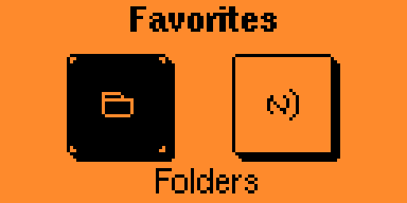
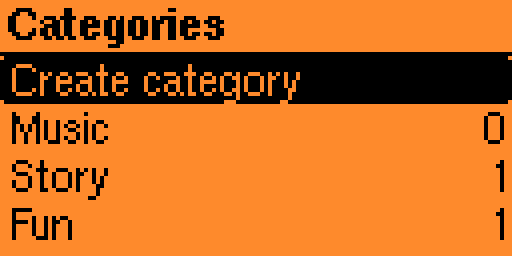
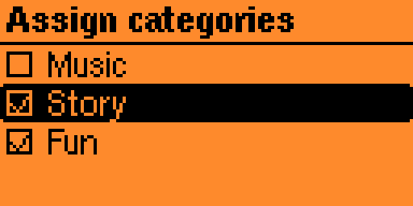

# StoryFlip 0.5.0

**StoryFlip** is a native Flipper Zero application for browsing, organizing, searching and directly emulating **SLIX `.nfc` files**.

It started as a personal tool for my own Flipper Zero and grew into a more complete library and playback interface.


> **Firmware note**
>
> StoryFlip has only been used and tested with **Momentum Firmware**.
>
> * Momentum mainline `mntm-012` from **2026-01-01**
> * Momentum dev `d3f89dfe` from **2026-08-18**
>
> The included 0.5.0 FAP is built against Momentum dev commit
> `d3f89dfe2ef6b01839201598e9be1590cba80322`,
> SDK API **87.1**, hardware target **7**.

## Highlights

* Browse SLIX `.nfc` files and folders
* Direct SLIX emulation
* NFC and folder favorites
* Separate or combined favorites view
* User-defined categories
* Assign one NFC file to multiple categories
* Replay the last successfully started NFC file
* 1 to 5 star ratings
* Recent history with up to 50 entries
* Most-played Top 50
* Persistent filename search
* Configurable collection root folder
* English, German and French UI
* Persistent settings and metadata
* Context menu for NFC-file actions

## Installation

Download the latest release from the [Releases page](https://github.com/lowsc0re/StoryFlip/releases).

Copy:

```text
storyflip.fap
```

to:

```text
/ext/apps/NFC/storyflip.fap
```

Then start **StoryFlip** from the NFC applications menu.

For a new installation the default collection root is:

```text
/ext/nfc/StoryFlip/
```

You can change it at any time under:

```text
Settings > Change Root Folder
```

StoryFlip stores its settings and metadata in:

```text
/ext/apps_data/storyflip/
```

Keep this directory when updating if you want to preserve your settings, favorites, ratings, history, categories and search data.

## Main menu

StoryFlip 0.5.0 uses eight entries:

| Row | Left | Left center | Right center | Right |
| --- | --- | --- | --- | --- |
| 1 | Collection | Favorites | Categories | Search |
| 2 | Replay | Recent | Statistics | Settings |

The UI language can be changed between **English**, **Deutsch** and **Français**.


## Collection

Open **Collection** to browse the configured root folder and its subfolders.


| Input | Action |
| --- | --- |
| Up / Down | Move through the current list |
| OK on a folder | Open the folder |
| OK on an NFC file | Start SLIX emulation |
| Back | Go to the parent folder or previous screen |
| **Hold Right on an NFC file** | Open the StoryFlip context menu |

## Context menu

Hold **Right** on an NFC file to open the StoryFlip context menu.


Available actions include:

* **Information**
* **Add favorite / Remove favorite**
* **Set rating**
* **Remove rating**
* **Assign categories**
* **Delete NFC file**

Deleting an NFC file always requires confirmation.

Favorites, ratings, statistics and category assignments are StoryFlip metadata and do not modify the original NFC file.

## SLIX emulation

Press **OK** on an NFC file to start emulation.

StoryFlip only starts files whose protocol is recognized as **SLIX**.

While emulation is active:

* the screen stays static
* long filenames can wrap across multiple lines
* **Back** stops emulation and returns to the previous list

The source NFC file is not modified during emulation.


## Favorites

StoryFlip supports favorites for both NFC files and folders.


Two favorites views are available:

* **Separate**  
  Folders and NFC files are opened through separate buttons.

* **List**  
  Folder favorites and NFC favorites are shown together in one list.



Opening a favorite folder starts browsing directly in that folder.

## Ratings and statistics

NFC files can be rated from **1 to 5 stars**.


The **Statistics** menu provides access to ratings, Most played and Categories.


### Most played

**Statistics > Most played** shows up to 50 entries ordered by start count.


### Categories in Statistics

**Statistics > Categories** shows your categories together with the number of assigned NFC files.

Press **OK** on a category to open its assigned files.

## Categories

Categories can be created and managed directly on the Flipper Zero.

Open:

```text
Categories > Create category
```

and enter a name using the on-device keyboard.



Hold **Right** on a category to rename or delete it.

Deleting a category removes only the category and its assignments. NFC files are not deleted.

### Assigning NFC files

From an NFC file context menu choose:

```text
Assign categories
```

One NFC file can belong to multiple categories.



## Recent and Replay

**Recent** shows up to **50** recently started distinct NFC files.


### Replay

**Replay** immediately starts the last successfully started NFC file.

The Replay entry remains available after restarting StoryFlip.

If the referenced file is missing or unsupported, StoryFlip shows an error instead of starting it.

## Search

StoryFlip uses a persistent filename index for fast searching across the configured collection.

On the first search, StoryFlip asks to build the index.

Search matches filenames and ignores ASCII letter case.

New or moved files become searchable after **Rebuild Search Index**.


## Changing the root folder

Open:

```text
Settings > Change Root Folder
```

Navigate into the desired directory and select:

```text
> Use this Folder
```

StoryFlip then offers to rebuild the search index for the new root.

## Settings

StoryFlip 0.5.0 provides:

1. Language
2. Index - diagnostic
3. Rebuild Search Index
4. Clear History
5. Clear Ratings
6. Clear Favorites
7. Clean Metadata
8. Change Root Folder
9. Favorites view
10. About StoryFlip


### Index - diagnostic

Shows information about the current search index and collection root.

### Clean Metadata

Removes StoryFlip metadata for files that no longer exist at their stored path.

### About StoryFlip

Shows the app name, version and a short development note.

## Updating from 0.4.2

Updating to 0.5.0 preserves existing settings and metadata.

The new category, folder-favorite and Replay data is stored separately and created automatically when needed.

The new favorites view defaults to **Separate**.

## AI-assisted development

StoryFlip is a personal project built with **AI-assisted coding**. I am not a software developer.

## Firmware compatibility

| Firmware | Date | Status |
| --- | --- | --- |
| Momentum mainline `mntm-012` | 2026-01-01 | Used/tested with StoryFlip |
| Momentum dev `d3f89dfe` | 2026-08-18 | Build SDK for 0.5.0 |
| Official Flipper Zero firmware | - | Not tested |
| Other custom firmware | - | Not tested |

The 0.5.0 binary is built against:

```text
d3f89dfe2ef6b01839201598e9be1590cba80322
```

## Building from source

Requirements:

* Python 3
* `ufbt`
* Internet access for the pinned Momentum SDK and ARM toolchain

From the project directory:

```bash
python3 build.py
```

On Windows:

```powershell
python build.py
```

Alternatively, place the project in a matching Momentum Firmware checkout under:

```text
applications_user/storyflip/
```

and build with:

```bash
./fbt fap_storyflip
```

## Build

The included 0.5.1 FAP has:

```text
SHA256: 7030b9303f2dad663c82c10e6227e945fbd57ba0d5e741c81d4e6c7f32adda2f
```

The 0.5.1 build passed the Momentum SDK build and FAP API checks.

## Credits and notices

StoryFlip depends on the Flipper Zero and Momentum Firmware SDK environment.

* Momentum Firmware: https://github.com/Next-Flip/Momentum-Firmware
* Flipper Zero Firmware: https://github.com/flipperdevices/flipperzero-firmware

Third-party asset and font notices are documented in:

* [ASSET-NOTICES.md](ASSET-NOTICES.md)
* [FONT-NOTICES.md](FONT-NOTICES.md)

## Disclaimer

StoryFlip is an independent project and is not affiliated with, sponsored by or endorsed by any NFC-content platform, Flipper Devices or the Momentum Firmware project.

Use NFC files only where you have the right to use them. StoryFlip does not include any NFC collection or third-party content.

## License

StoryFlip is distributed under the **GNU General Public License v3.0**. See [LICENSE](LICENSE).

---

**Version 0.5.0**
